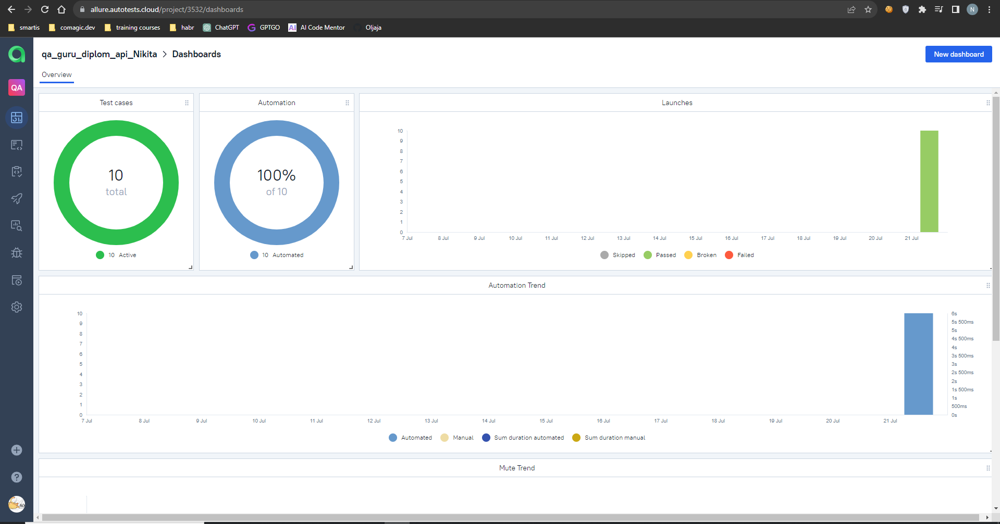
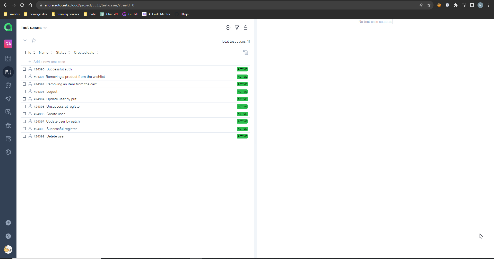

## Autotests API Project
### Technologies used

<code></code>
<code></code>
<code></code>
<code></code>
<code></code>
<code></code>
<code></code>
<code></code>
<code></code>
<code></code>
<code></code>

  

### The project consists of two groups of tests:

<b>reqres.in - only api api</b>

<ul>
  <li>Create user</li>
  <li>Update user by put</li>
  <li>Update user by patch</li>
  <li>Delete user</li>
  <li>Successful registration</li>
  <li>Unsuccessful registration</li>
</ul>

<b>demowebshop - ui\api tests</b>

  
<ul>
  <li>Successful auth</li>
  <li>Removing a product from the wishlist</li>
  <li>Removing an item from the cart</li>
  <li>Logout</li>
</ul>

 

###  [Running a project in Jenkins](https://jenkins.autotests.cloud/job/qa_guru_diplom_api_Nikita/)
##### Clicking on "Build Now" will start building the tests and running them on the Jenkins server.

###  [Allure report](https://jenkins.autotests.cloud/job/qa_guru_diplom_api_Nikita/2/allure/)
##### After passing the tests, the results can be viewed in the Allure report.

##### ВOn the Behaviors tab, there are collected test cases, which describe the steps. Attachments are implemented for api methods. For combined tests, at the end of the test, a screenshot is taken and a video recording of the test is saved.

##### Video of the test Removing goods from the cart, adding is done by api, deleting through ui.

https://selenoid.autotests.cloud/video/88edc5171ccaae2a7e01d5cb4605f4f8.mp4

###   [Integration with Allure TestOps](https://allure.autotests.cloud/project/3532/dashboards)

##### Also, all reporting is saved in Allure TestOps, where similar graphs are built.

#### In the suites tab, we can:
- Manage all test cases or each separately
- Rerun each test separately from all tests
- Set up integration with Jira
- Add manual tests, etc.

###  [Jira integration](https://jira.autotests.cloud/browse/HOMEWORK-798)
##### By setting up integration with Jira through Allure TestOps, you can forward the result of passing tests and a list of test cases from Allure to a ticket

